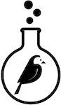

Wagtail Experiments
===================

.. image:: https://api.travis-ci.org/torchbox/wagtail-experiments.svg?branch=master
    :target: https://travis-ci.org/torchbox/wagtail-experiments

**A/B testing for Wagtail**

This module supports the creation of A/B testing experiments within a Wagtail site. Several alternative versions of a page are set up, and on visiting a designated control page, a user is presented with one of those variations, selected at random (using a simplified version of the `PlanOut algorithm <https://facebook.github.io/planout/>`_). The number of visitors receiving each variation is logged, along with the number that subsequently go on to complete the experiment by visiting a designated goal page.

Installation
------------

wagtail-experiments is compatible with Wagtail 1.7, and Django 1.8 to 1.10. To install::

    pip install wagtail-experiments

and ensure that the apps ``wagtail.contrib.modeladmin`` and ``experiments`` are included in your project's ``INSTALLED_APPS``:

.. code-block:: python

    INSTALLED_APPS = [
        # ...
        'wagtail.contrib.modeladmin',
        'experiments',
        # ...
    ]

Usage
-----

After installation, a new 'Experiments' item is added to the Wagtail admin menu under Settings. This is available to superusers and any other users with add/edit permissions on experiments. An experiment is created by specifying a control page and any number of alternative versions of that page, along with an optional goal page. Initially the experiment is in the 'draft' status and does not take effect on the site front-end; to begin the experiment, change the status to 'live'.

When the experiment is live, a user visiting the URL of the control page will be randomly assigned to a test group, to be served either the control page or one of the alternative variations. This assignment persists for the user's session (according to `Django's session configuration <https://docs.djangoproject.com/en/1.10/topics/http/sessions/#browser-length-sessions-vs-persistent-sessions>`_) so that each user receives the same variation each time. When a user subsequently visits the goal page, they are considered to have completed the experiment and a completion is logged against that user's test group. The completion rate over time for each test group can then be viewed through the admin interface, under 'View report'.

From the report page, an administrator can select a winning variation; the experiment status is then changed to 'completed', and all visitors to the control page are served the chosen variation.

Typically, the alternative versions of the page will be left unpublished, as this prevents them from appearing as duplicate copies of the control page in the site navigation. If an unpublished page is selected as an alternative, the page revision shown to users on the front-end will be the draft revision that existed at the moment the experiment status was set to 'live'. When displaying an alternative variation, the title and tree location are overridden to appear as the control page's title and location; this means that the title of the alternative page can be set to something descriptive, such as "Signup page (blue text)", without this text 'leaking' to site visitors.

Direct URLs for goal completion
-------------------------------

If you want goal completion to be linked to some action other than visiting a designated Wagtail page - for example, clicking a 'follow us on Twitter' link - you can set up a Javascript action that sends a request to a URL such as ``/experiments/complete/twitter-follow/`` , where ``twitter-follow`` is the experiment slug. To set this URL route up, add the following to your URLconf:

.. code-block:: python

    from experiments import views as experiment_views

    urlpatterns = [
        # ...

        url(r'^experiments/complete/([^\/]+)/$', experiment_views.record_completion),

        # ...
    ]

Alternative backends
--------------------

wagtail-experiments supports pluggable backends for tracking participants and completions. The default backend, ``experiments.backends.db``, records these in a database table, aggregated by day. Alternative backends can be specified through the ``WAGTAIL_EXPERIMENTS_BACKEND`` setting:

.. code-block:: python

    WAGTAIL_EXPERIMENTS_BACKEND = 'mypackage.backends.thecloud'

A backend is a Python module that provides the following functions:

**record_participant(experiment, user_id, variation, request):**

Called when a user visits the control page for ``experiment``. ``user_id`` is the persistent user ID assigned to that visitor; ``variation`` is the Page object for the variation to be served; and ``request`` is the user's current request.

**record_completion(experiment, user_id, variation, request):**

Called when a visitor completes the ``experiment``, either by visiting the goal page or triggering the ``record_completion``. ``user_id`` is the persistent user ID assigned to that visitor; ``variation`` is the Page object for the variation that was originally served to that user; and ``request`` is the user's current request.

**get_report(experiment):**

Returns report data for ``experiment``, consisting of a dict containing:

``variations``
  A list of records, one for each variation (including the control page). Each record is a dict containing:

  ``variation_pk``
    The primary key of the Page object

  ``is_control``
    A boolean indicating whether this is the control page

  ``is_winner``
    A boolean indicating whether this variation has been chosen as the winner

  ``total_participant_count``
    The number of visitors who have been assigned this variation

  ``total_completion_count``
    The number of visitors assigned this variation who have gone on to complete the experiment

  ``history``
    A list of dicts showing the breakdown of participants and completions over time; each dict contains ``date``, ``participant_count`` and ``completion_count``.
